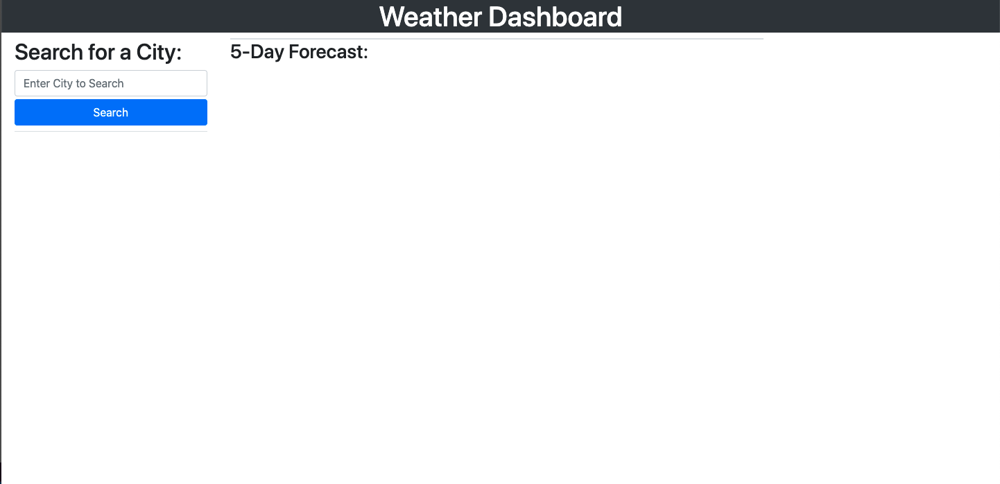
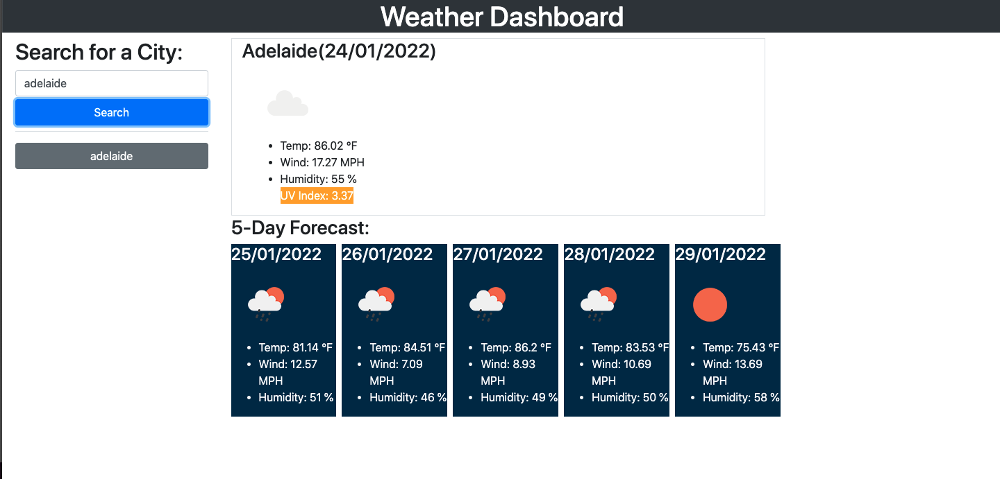
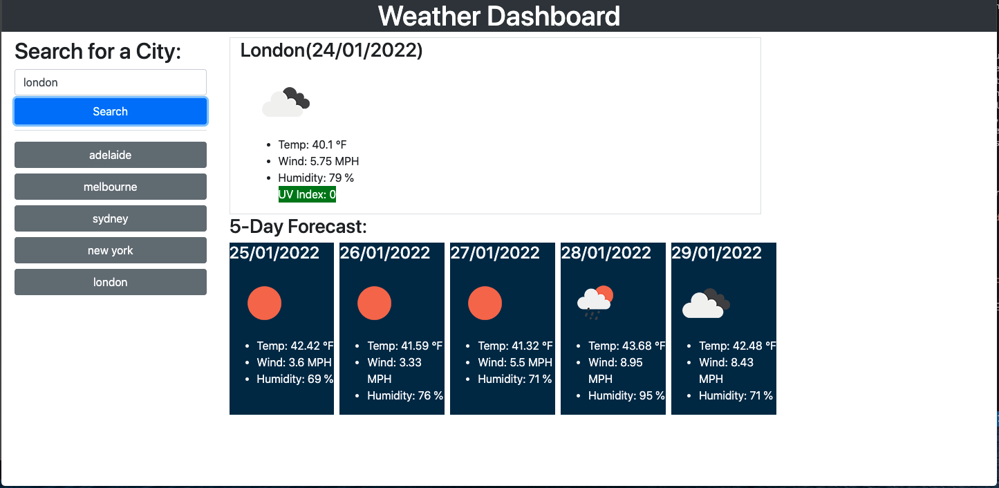

# 06 Server-Side APIs: Weather Dashboard

## The Project
For this project we had to make a weather dashboard for a traveller who wanted to look out the weather outlook for multiple cities so they could plan their trips accordingly.

When the user searches for a city, the user should be presented with current and future conditions for the city and then that city should be added to the search history. The current weather conditions should include the city name, the date, an icon representation of the weather, the temperature, the humidity, the wind speed and the UV index. The UV index should change colours dependendant on if the conditions are favourable, moderate or severe. When the user is looking at the 5 day forecast for the city, they should be presented with the dates, an icon representaion of the weather, the temperature, wind speed and humidity. When the user clicks on one of the cities in the search history, they should then be presented with the current and future weather conditions for that city.
## Mock-Up

The following image shows the web application's appearance and functionality:

## Finished Product

## A link to the webpage is shown below:
https://lconnell1000.github.io/Weather-Dashboard/